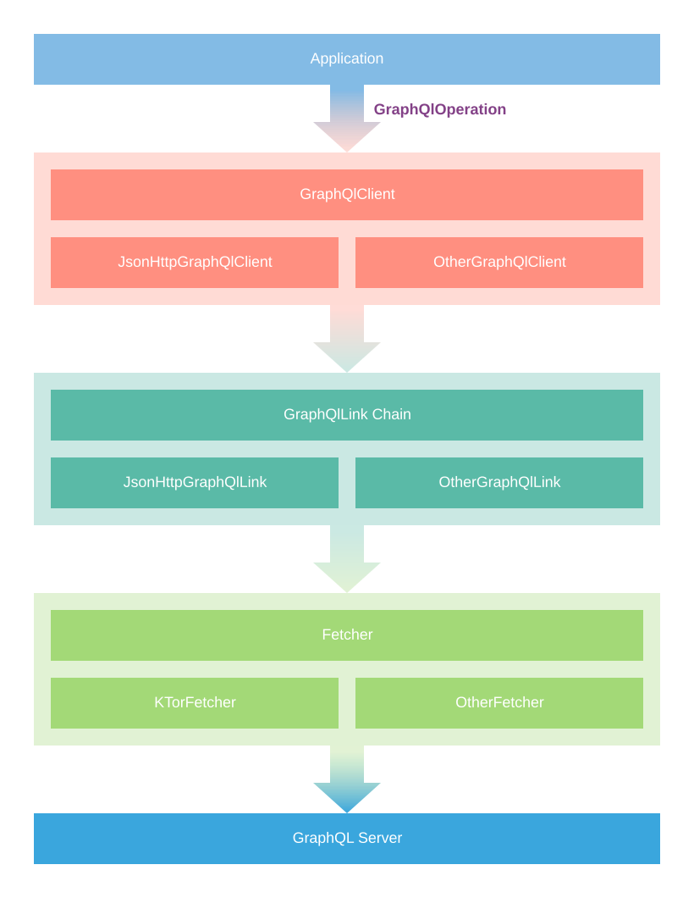
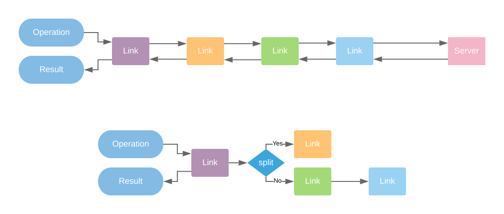

# Overview

`suparnatural-graphql` consists of a couple of different components which together provide a delightful
developer experience when working with GraphQL. Those components and related concepts are in the following
sections.

## Architecture

The diagram below gives a high level overview of how various components are layered and interact with each other. By default, the package provides `JsonHttp` prefixed implementations of these components.



## Operation

A `GraphQlOperation` instance represents an operation to be performed against a GraphQL server. For every operation processed
by the `gradle` plugin, a class implementing `GraphQLOpertion` is created. The operation arguments can be passsed in the constructor. To perform any operation, simply create an instance of the required operation class and pass it to the `client`.

The `jsonString` property returns a serialized `JSON` which can be sent to the GraphQL server. Therefore, the operation instance can be used with any `JSON` supported client directly. The response is deserialized by using `responseDeserializer` property which maps the raw `JSON` into strict types.

### Operation Context

A `GraphQlOperation` instance has a shared map `context` which can be used to keep `metadata`. For example, `context` can hold a `boolean` to decide whether to track this operation in your analytics engine. The `context` map combined with `Link` chain give a lot of power and flexibility to isolate logic tied to GraphQL from business logic which would otherwise spill over into business logic. The `context` is not type checked in order to provide the maximum amount of flexibility. However, you can store a typed object as a value in the map and later retrieve it if you want type safe context.

## Fetcher

A `Fetcher` fetches resources from a server. `HttpFetcher` is a `Fetcher` which works with `Http` and a `JsonHttpFetcher` is an `HttpFetcher` which works with `JSON` string payloads for both request and response body. You can think of `Fetcher` as your usual rest client. 

Generally, client libraries come bundled with a fetcher implementation. For example, [apollo-ios](https://www.apollographql.com/docs/ios/fetching-queries/#creating-queries) comes with a built-in `fetch` implementation. However, such a "works out of the box" approach may not be suitable for projects of all complexity levels. Following examples highlight such limitations:

1. You may want to pin and verify certificates before making a network request.
2. You are already using a networking client and configured it in a special way which should be carried on to the GraphQL requests.
3. Your project / company / clients only trusts one networking library for security.

That is why, the default `JsonHttp` implementation of client doesn't make any assumption on how you implement the network transport as long as your implementation conforms with the `JsonHttpFetcher` interface. You can apply the same concept to your custom client implementations.

Below are some examples of how fetcher can be implemented on different platforms 

### [Ktor](https://ktor.io/clients/index.html) Fetcher

```kotlin
class KtorFetcher : JsonHttpFetcher {
    override fun fetch(
        request: JsonHttpFetchRequest,
        handler: (JsonHttpFetchResponse) -> Unit
    ) {
        // launch fetch in background
        GlobalScope.launch {
            val client = HttpClient()
            try {
                val response = client.post<HttpResponse>(request.url) {
                    this.body = TextContent(request.body ?: "{}", contentType = ContentType.Application.Json)
                }
                val body = response.readText(Charset.forName("UTF-8"))
                handler(JsonHttpFetchResponse(body, response.status.value, ""))
            } catch (e: ClientRequestException) {
                val body = e.response.readText(Charset.forName("UTF-8"))

                handler(JsonHttpFetchResponse(body, e.response.status.value, e.localizedMessage))
            } catch (e: Exception) {
                handler(JsonHttpFetchResponse(null, 0, e.localizedMessage))
            }
        }
    }
}
```

### OkHttp Fetcher

```kotlin
class OkHttpFetcher : JsonHttpFetcher {
    override fun fetch(request: JsonHttpFetchRequest, handler: (JsonHttpFetchResponse) -> Unit) {
        val client = OkHttpClient()
        val body = (request.body ?: "").toRequestBody("application/json; charset=utf-8".toMediaType())
        val r = Request.Builder().url(request.url).post(body).build()
        val thread = HandlerThread("okhttp")
        thread.start()
        val h = Handler(thread.looper)
        h.post {
            client.newCall(r).execute().use {
                val responseBody = it.body?.string()
                handler(JsonHttpFetchResponse(responseBody, it.code, it.message))
            }
        }
    }
}
```

### NSURLSession Fetcher

```kotlin
class IOSFetcher : JsonHttpFetcher {
    override fun fetch(request: JsonHttpFetchRequest, handler: (JsonHttpFetchResponse) -> Unit) {
        NsUrlSessionFetcher(handler).fetch(request)
    }
}

// convert MutableData to NSData
private fun MutableData.asNSData() = this.withPointerLocked { it, size ->
    val result = NSMutableData.create(length = size.convert())!!
    memcpy(result.mutableBytes, it, size.convert())
    result
}

// NSURLSession based fetch which operates on a background queue
internal class NsUrlSessionFetcher(val handler: (JsonHttpFetchResponse) -> Unit) : NSObject(),
    NSURLSessionDataDelegateProtocol {
    private val asyncQueue = NSOperationQueue()
    private val receivedData = MutableData()

    init {
        freeze()
    }

    fun fetch(request: JsonHttpFetchRequest) {
        receivedData.reset()
        val session = NSURLSession.sessionWithConfiguration(
            NSURLSessionConfiguration.defaultSessionConfiguration(),
            this,
            delegateQueue = asyncQueue
        )
        val url = NSURL.URLWithString(request.url)!!
        val r = NSMutableURLRequest.requestWithURL(url)
        r.HTTPMethod = "POST"
        r.setValue("application/json", "Accept")
        r.setValue("application/json", "Content-Type")
        request.headers?.entries?.forEach {
            r.setValue(it.value, it.key)
        }
        r.HTTPBody = ((request.body ?: "") as NSString).dataUsingEncoding(NSUTF8StringEncoding)
        session.dataTaskWithRequest(r).resume()
    }


    override fun URLSession(session: NSURLSession, dataTask: NSURLSessionDataTask, didReceiveData: NSData) {
        initRuntimeIfNeeded()
        receivedData.append(didReceiveData.bytes, didReceiveData.length.convert())
    }

    override fun URLSession(session: NSURLSession, task: NSURLSessionTask, didCompleteWithError: NSError?) {
        initRuntimeIfNeeded()

        val response = task.response as? NSHTTPURLResponse
        // process error.  Of course, handling should be better. :)
        if (didCompleteWithError != null) {
            handler(JsonHttpFetchResponse(null, -1, didCompleteWithError.localizedDescription))
            return
        }

        // process response. Of course, handling should be better. :)
        val statusCode = if (response != null) (response as NSHTTPURLResponse).statusCode.toInt() else -2
        val statusMessage = ""
        val body = if (receivedData.size > 0) NSString.create(receivedData.asNSData(), NSUTF8StringEncoding).toString() else null
        handler(JsonHttpFetchResponse(body, statusCode, statusMessage))
    }
}
```

## Link

Links are small composable units of logic which can be joined together to form a control flow chain. A link chain is also a link which can be futher extended. Each `Link<A, T, V>` has only one method `execute` which takes an input of type `A` and returns an observable of type `V`. A `GraphQlLink<T, V>` is a `Link` which takes a `GraphQlOperation` as an input and returns an observable of type `V`. We will cover the type `T` in the next section. 

### Composition

Several links can be combined linearly to form a chain. `Link` operators like `split` allow you to create complex control flows. For example, a link in the chain can add some tracking metadata to the operation context. A subsequent link in the chain can then extract that metadata and track the request metrics in your analytics service. Two links `link1: Link<A, T, V>` and `link2: Link<A, B, C>` can be chained by using `chain = link1.concat(link2)` if and only if the type `T` and `C` are the same. This provides a compile time guarantee that `link1` will be able to post process the observable response from `link2`.  The following diagram describes the concept of a link chain.




### Link Execution

A Link acts both as a middleware and an afterware. It can perform side effects on the operation before the request goes to GraphQL server and can also process the response returned from the server or the next link. The `GraphQlLink.execute` method takes two arguments; a `GraphQlOperation` instance and the `next` `GraphQlLink` instance in the chain. The link can then process the operation and call the `execute` method of the next link in the chain if present. Since the value returned from `next.execute` is also an observable, the calling link can post process the received value and return a new value instead.

```kotlin
class CustomLink : Link<GraphQlLink, TypeA, TypeB> {
    override fun execute(operation: GraphQlOperation<*>, next: Link<GraphQlOperation<*>, *, TypeA>?): Observable<TypeB> {
        // middleware - modify the operation before sending to next link
        operation.context["key"] = "value"

        // afterware - wait for the response from next link and post process it
        return (next?.execute(operation) ?: observableOf(null)).map {
            //post process the response
        }
    }
}
```

### Terminating Link

The last link in the chain receives `null` value for `next` argument in `execute`. It is expected that a terminating link returns an observable which contains GraphQL server response. `JsonHttpGraphQlLink` is a terminating link which sends a JSON request using the provided `JsonHttpFetcher` implementation and returns an observable of type `JsonHttpFetchResponse`.

## Client
A client executes an operation against a GraphQl server and returns an `Observable`. It accepts a chain of `Link` which emits the final response of type `T`. The client should not concern itself with how to make a network request. Rather, it should rely on the last `Link` of the `chain` as terminating link which fetches the response from the server. `JsonHttpGraphQlLink` is one such link. The client should then take the response as input and transform it into the correct response type based on the operation.

The `Observable` returned from `execute` returns an instance of `Result` for both success and failure responses and thus, it never throws an error. This is intentional as the underlying `Observable` implementation may change in the upcoming released. This should ensure that such a change won't break your application.

```kotlin
client.execute(operation).subscribe {
    when(it) {
        is Result.Success -> {
            println(" Successful ${it.value.data}")
        }
        is Result.Failure -> {
            println("Failed ${it.value.error} ${it.value.response} ${it.cause}")
        }
    }
}
```

## Example

```kotlin
fun main() {
    val ktorFetcher = KtorFetcher()
    val httpLink = JsonHttpGraphQlLink(ktorFetcher, "https://countries.trevorblades.com")
    val client = JsonHttpGraphQlClient(httpLink)
    val operation = Operations.Countries() // generated by plugin

    client.execute(operation)
        .subscribe {
            when(it) {
                is Result.Success -> {
                    println(" Successful ${it.value.data}")
                }
                is Result.Failure -> {
                    println("Failed ${it.value.error} ${it.value.response} ${it.cause}")
                }
            }
        }

    runBlocking {
        kotlinx.coroutines.delay(10000)
    }
}
```